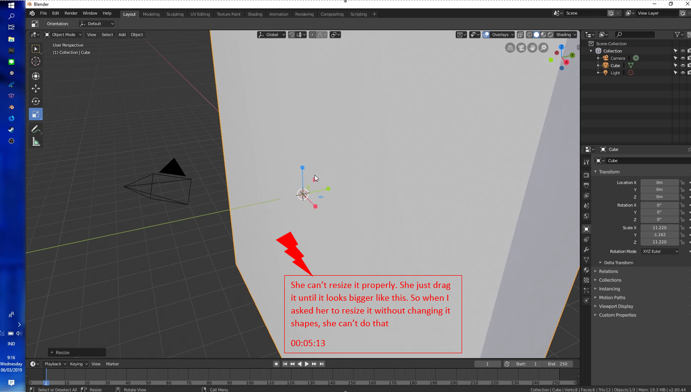
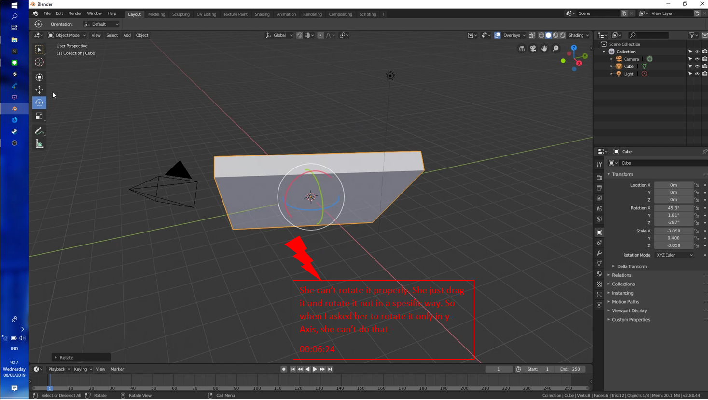
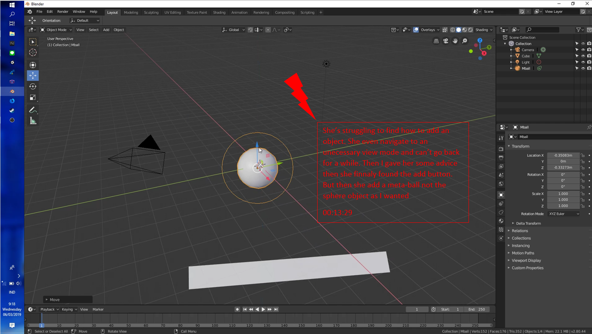
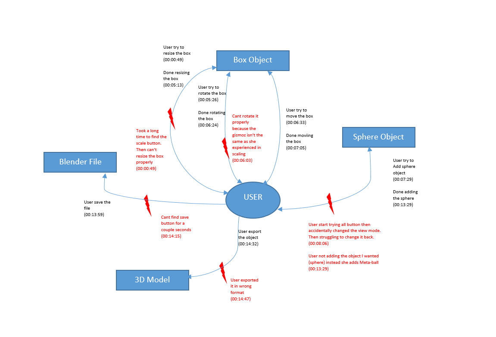
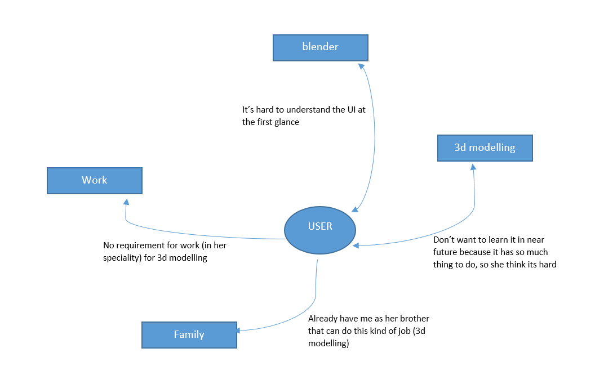

# Contextual Inquiry and Analysis
## Blender 3D Description
Blender is the free and open source 3D creation suite. It supports the  entirety of the 3D pipeline—modeling, rigging, animation, simulation,  rendering, compositing and motion tracking, even video editing and game  creation. Advanced users employ Blender’s API for Python scripting to  customize the application and write specialized tools; often these are  included in Blender’s future releases. Blender is well suited to  individuals and small studios who benefit from its unified pipeline and  responsive development process.

## Instruction Script
1. Resize the box object in the new project
2. Rotate the box
3. Move the box
4. Add sphere object to the project
5. Save the blender file
6. Export the file to 3d object with format .FBX

## User Description
- She is a female
- She is 22 years old
- Public Health college student at  Airlangga University
- Never done a 3d modelling
- Never use blender 3d
- Sometime uses graphic design application

## Transcript
```
😈 its me
😇 its the user

1. 😈 	: Sampeyan pernah nggawe aplikasi 3d modelling gak?
2. 😇 	: Gak tau kok. Iki ndak mbok jelasno sek ta?
3. 😈 	: Ndak lah
4. 😇 	: Lah ketok goblog aku engkuk
5. 😈 	: Lah iku tujuane ncen, ndelokno sampeyan goblog nggawe aplikasi iki.
6. 😇 	: Oh ngunu ta. (opening the application) Aduh bib, opo iki bib.
7. 😈 	: Yo coba coba sek wes. Saiki pertama coba sampeyan ngganti ukuran e box e dadi luwih gedhe
8. 😇 	: hmmm. (hovering the mouse all over the screen looking for a button)
9. (a couple of minutes later of her complaining to me)
10. 😇 	: Yaopo carane, gak jelas tombol-tombol e
11. 😈 	: Coba sampeyan gerakno mouse e nang salah satu tombol, terus enteni sampe muncul tulisan e, iku tulisane iku jeneng tombol e
12. 😇 	: (tried it) Oh ngunu ta. Hoo brarti tulisan e kiro-kiro podo karo fungsine
13. 😈 	: Paling? Coba ae
14. 😇 	: (found a button with the name of "Scale") oh iki pasti. (can't click it properly because of using touchpad,  then I offer her to use a mouse) Nah ngene lho luwih gampang (clicked it) terus lapo iki.
15. 😈 	: Yo embo coba-coba sek ae.
16. 😇 	: (realized that there is some line that is appearing after she clicked it, then try to drag it with mouse) Hoo iki bener wes an (task 1 completed)
17. 😈 	: Mantap, saiki coba puter objek e
18. 😇 	: Gampang wes an kari nggolek tombol e mneh. (searching for the button then found a button named "Rotate") Iki kan? (clicked it)
19. 😈 	: Cobak ae koh
20. 😇 	: (Realized that now there is no line appearing like last time instead there is a wired circle around the object) Loh yaopo iki lek pingin muter?
21. 😈 	: Yo embo
22. 😇 	: (clicked the mouse left button and then drag it) oh ngene toh. Iki wes mari brarti? (task 2 completed)
23. 😈  : Okee, saiki coba ganti posisine
24. 😇 	:(looking for a button, then found move button) Oh sama kayak scale (then she moves the box free)
25. 😈  : Oke, saiki coba tambahno objek bola
26. (It tooks her a couples of minutes to look for the button so I gave her a hint)
27. 😈 	: Coba golek nang toolbars sing dek duwur
28. 😇 	: (Looking for it, then found it) Oh ikii!! (then add the sphere object)
29. 😈  : Oke, saiki coba save file e, karo export dadi objek 3d format .FBX
30. (Apparently she can do this task normally because the experience of using graphic design app. its not that much difference)
30. 😇 	: uwes
31. 😈 	: Mantap mantap, suwuuuunnnn
32. 😇 	: okee
```

## Models and Annotations
### Artifact Model






### Flow Model
#### 

### Cultural Model

## Do's and Don't's
#### Do's

- Make the button of some function that is often used by user to be more visible, like Add, Move, Rotate, Scale, etc
- Make the button of some function that is seldom used by user to be more difficult to reach, so the user who is a novice won't accidentally clicked it
- Add some sort of tips as a pop up window when the user start the program, so user can easily remember how to do something and how not to do something
- Create a button to open a window that has the keyboard's shortcuts

#### Don't's

- Don't hide the button that often used by user in the toolbar's dropdown menu
- Don't make a function that can only be called using keyboard shortcuts

# Remarks
> * Thanks for completing all the parts in this assignment.
> * Just a little comments: Since you use time-codes to annotate the breakdowns in the `Models`, it is better to use time-codes as well in the `Transcript` instead of line-numbers. Thus, readers can track back easily the evidences of the breakdowns.

| Working Days | Commits before D | Commits after D | Presentation (80%) | Repo (20%) | Total |
|:------------:|:----------------:|:---------------:|:------------------:|:----------:|:-----:|
| 1            | 2                | 0               | 88                 | 76,5       | 85,7  |
